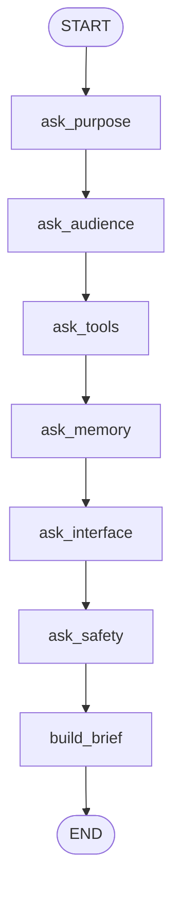
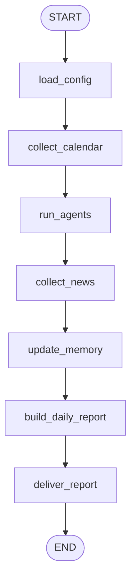

# Bichangi Agent

LangGraph format assistant project. The first graph asks focused questions, stores the answers in state, and produces an implementation brief for the real assistant.

The deployment target is Cloudflare Workers with API routes and static dashboard assets in one serverless app.

## Question graph



## Daily run graph



## Run later

```powershell
python -m venv .venv
.\.venv\Scripts\Activate.ps1
pip install -e .
copy .env.example .env
codex-secretary run-daily
codex-secretary web
```

The current requirements are stored in `docs/assistant-spec.md` and summarized in `docs/build-brief.md`.

## Run without installing

Codex Desktop includes a bundled Python runtime. You can run the current mock workflow directly:

```powershell
$env:PYTHONPATH='src'
& 'C:\Users\1988n\.cache\codex-runtimes\codex-primary-runtime\dependencies\python\python.exe' -m codex_secretary.cli run-daily
& 'C:\Users\1988n\.cache\codex-runtimes\codex-primary-runtime\dependencies\python\python.exe' -m codex_secretary.cli web
```

The generated report is written to `data/reports/YYYY-MM-DD.md`, and the dashboard reads `data/latest_report.json`.

## Cloudflare Worker

Serverless BE/FE source lives in:

- `worker/index.ts` for API routes and scheduled daily execution.
- `public/` for the local dashboard UI.
- `wrangler.jsonc` for Cloudflare Workers deployment config.

Local/dev commands after installing Node dependencies:

```powershell
npm install
npm run check
npm run dev
npm run deploy:dry-run
npm run deploy
```

Configured API routes:

- `GET /api/health`
- `GET /api/report/latest`
- `POST /api/report/run`

Secrets to add later:

```powershell
npx wrangler secret put KAKAO_WEBHOOK_URL
npx wrangler secret put GOOGLE_DRIVE_REPORT_ENDPOINT
npx wrangler secret put GOOGLE_CALENDAR_ENDPOINT
npx wrangler secret put AGENT_TUCHANGI_URL
npx wrangler secret put AGENT_GACHANGI_URL
npx wrangler secret put AGENT_DACHANGI_URL
npx wrangler secret put AGENT_BUCHANGI_URL
npx wrangler secret put NEWS_RSS_URLS
npx wrangler secret put NEWS_SEARCH_ENDPOINT
```

See `docs/integration-setup.md` for Google Calendar, Google Drive, KakaoTalk, and OAuth setup notes.

To set secrets interactively without printing values:

```powershell
.\scripts\set-secrets.ps1
```

The final source remote should be `https://github.com/1988nam/Bichangi-Agent`.
